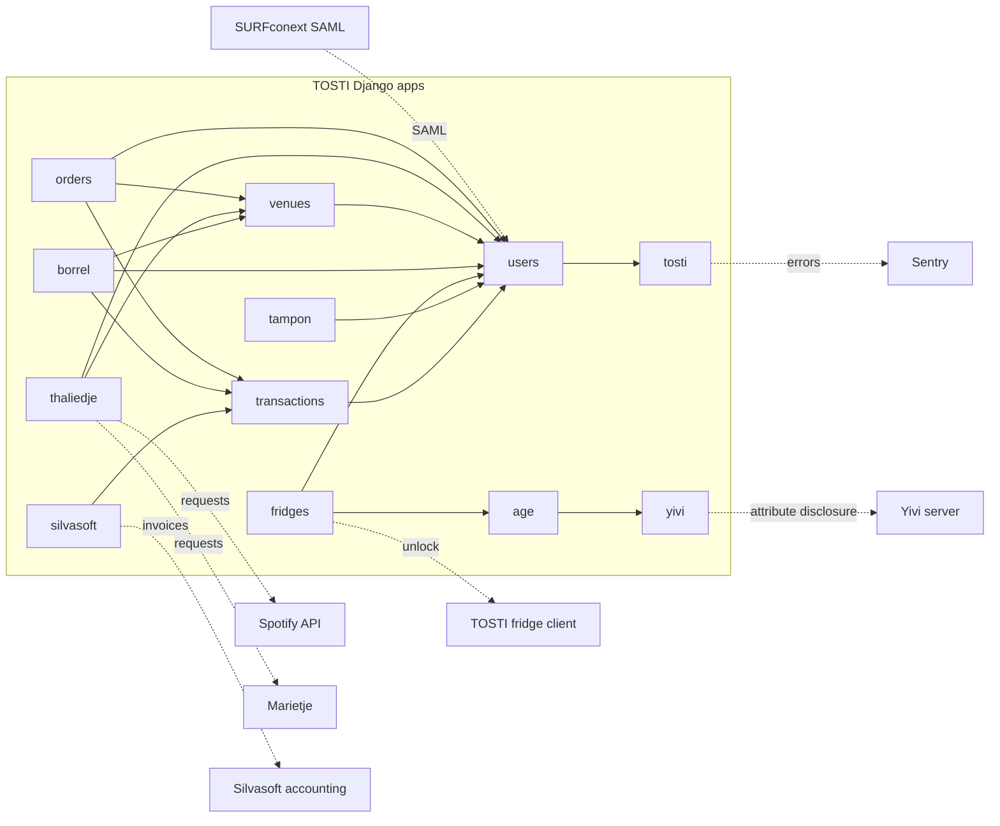
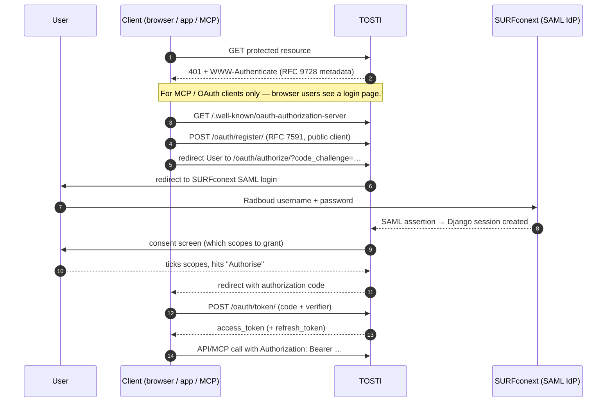

# TOSTI - Tartarus Order System for Take-away Items

[](https://github.com/KiOui/TOSTI/actions/workflows/ci.yaml)
[](https://github.com/KiOui/TOSTI/actions/workflows/deploy.yaml)
[](https://opensource.org/licenses/MIT)

TOSTI is the order system that runs the canteens in the Huygens building at Radboud University. Originally built for [Tartarus](https://tartarus.science.ru.nl) and now shared across study associations that operate canteens there, it covers ordering, payments, music, age-gated beer fridges, venue reservations, borrels, and a handful of adjacent things that the canteens need.

It lives at <https://tosti.science.ru.nl> and is maintained by the website committee of Tartarus.

## 🎯 Scope — what belongs in TOSTI

**TOSTI is the system for the Huygens-building canteens, shared by all study associations that use them.** That's the entire scope. Before adding a feature, check that it satisfies all three of these conditions:

1. **Canteen-related.** The feature exists because of, or in service of, the physical canteens (ordering, payments, music, fridges, venue reservations, age checks for the bar, …). If you can build it without TOSTI being a canteen system, it doesn't belong here.
2. **Available to all students.** Every authenticated Radboud student can use it. Features that only serve one association, one committee, or a private subset of users belong in that group's own tooling, not in TOSTI.
3. **Shared by all participating associations.** A feature that benefits one association but not the others is out of scope. Build it in that association's own systems.

If a proposed feature fails any of these tests, it doesn't belong in TOSTI — even if it's well-built, even if it's small, even if "we already have the auth and the user accounts so it'd be easy to bolt on." Resist that. Feature creep is the single biggest risk to this project's long-term maintainability. Each added feature is a permanent maintenance burden carried by future volunteers.

When in doubt, **don't**. Open an issue and let the website committee weigh in before writing code.

## 🚀 What it does

The user-facing surface:

- **Ordering** at the canteen counter — pick a venue, pick products, the bakers see your order in a live queue and call your name when it's ready.
- **Music** in the canteens — a shared jukebox where anyone with an account can request a song to be added to the venue's queue. Backed by Spotify in the Noordkantine and Marietje (read-only) in the Zuidkantine.
- **Beer fridges** — age-gated digital locks. Verify your age once with Yivi and the fridge will open for you (during opening hours).
- **Venue reservations** — book canteens and meeting rooms; a calendar shows what's coming up.
- **Borrels** — event reservations with inventory tracking.
- **Bathroom-stock notifications (T.A.M.P.O.N.)** — report empty or damaged menstrual-product boxes so the MenstruaCie can restock.
- **Balance & deposits** — hand in deposit cans for credit, spend the credit on future purchases.

Cross-cutting:

- **Single sign-on** via SAML (SURFconext federation → Radboud accounts).
- **Public REST API** at `/api/v1/` with OAuth 2.0 authentication.
- **MCP server** at `/mcp` so AI assistants can act on a user's behalf with their permission. See [`/oauth/docs/`](https://tosti.science.ru.nl/oauth/docs/) and [`/mcp/docs/`](https://tosti.science.ru.nl/mcp/docs/) on a running deployment.
- **iCal feeds** for reservations.
- **Statistics page** showing the canteens' activity.

## 🏗️ Architecture at a glance



The graph isn't a hard import dependency — it's the natural data-flow story. Each app keeps its concerns local; cross-app coupling is meant to stay minimal (see [Modular Django apps](#modular-django-apps)).

### Tech stack

- **Backend**: Django 6 on Python 3.14.
- **Frontend**: Django templates + Bootstrap 5; Vue 3 for the interactive bits.
- **Database**: PostgreSQL in production, SQLite in development.
- **Caching**: file-backed in production, in-memory in development.
- **Async tasks**: Celery + Redis for jobs (e.g. emails); `django-celery-beat` schedules periodic work.
- **Auth**: SAML 2 (`djangosaml2`) federating to SURFconext. OAuth 2.0 (`django-oauth-toolkit`) for the public API + MCP.
- **API**: Django REST Framework + `drf-spectacular` for OpenAPI.
- **MCP**: in-process `django-mcp-server` at `/mcp`.
- **Error tracking**: Sentry SDK.
- **Container/deploy**: Docker Compose + Caddy on a self-hosted VM; CI/CD via GitHub Actions.

### Auth flow (SAML + OAuth + MCP)

The same identity chain serves the website, the API, and AI assistants. Anything that protects a route ultimately resolves through this path:



The `/oauth/docs/` page on a running deployment goes into detail on the OAuth flow specifically (which grant type, where to register, what scopes exist).

### Modular Django apps

Each piece of TOSTI functionality lives in its own Django app, with **minimal cross-app dependencies**. The goal is that adding or removing a feature should be as simple as adding or removing a line from `INSTALLED_APPS` — no other app should break, no template should fail to render, no URL should 500.

In practice: models, views, URLs, services, signals, API endpoints (`<app>/api/v1/`), and MCP tools (`<app>/mcp.py`) for a feature all live inside that feature's app. The `tosti` app contains only shared infrastructure (settings, base templates, cross-cutting helpers).

When you build a new feature, build it as its own app. The full rationale and conventions are in [`AGENTS.md`](AGENTS.md) and [`CONTRIBUTING.md`](CONTRIBUTING.md).

## 📁 Project structure

```text
website/
├── age/                    # Age verification gate (fronts yivi/)
├── announcements/          # Banner / popup announcements
├── associations/           # Study associations metadata
├── borrel/                 # Borrel reservations + inventory
├── cron/                   # Custom periodic-job framework
├── fridges/                # Smart beer-fridge unlock flow
├── orders/                 # Core: shifts, products, orders
├── qualifications/         # User qualifications (e.g. borrel brevet)
├── silvasoft/              # Silvasoft accounting sync
├── status_screen/          # Order status display for the canteen TV
├── tampon/                 # T.A.M.P.O.N. menstrual-products tracker
├── thaliedje/              # Music players (Spotify + Marietje)
├── tosti/                  # Shared infra: settings, templates, OAuth, MCP
├── transactions/           # User balance + transactions log
├── users/                  # User model + auth glue
├── venues/                 # Venues + reservations + calendar
└── yivi/                   # Yivi attribute-disclosure adapter
```

Bigger apps (`orders`, `thaliedje`, `tosti`, `silvasoft`, `venues`, `borrel`) have their own `README.md` with the data model and quirks. Smaller apps are short enough to read directly.

## 🛠️ Local development

### Prerequisites

- Python 3.14+ (recommended: [pyenv](https://github.com/pyenv/pyenv))
- [uv](https://docs.astral.sh/uv/) for dependency management
- Git

### Setup

```bash
git clone https://github.com/KiOui/TOSTI.git
cd TOSTI

# Install uv if you don't have it
curl -LsSf https://astral.sh/uv/install.sh | sh

# Install dependencies + dev tools
uv sync --locked --all-extras --dev

# Initialise the database
cd website
uv run ./manage.py migrate

# Create a superuser for the admin
uv run ./manage.py createsuperuser

# Optional: load demo fixtures
uv run ./manage.py loaddata tosti/fixtures/default.json

# Run the dev server
uv run ./manage.py runserver
```

The app will be on <http://localhost:8000>. SAML is disabled in development; use `/admin-login` to sign in with the superuser you just created. Interactive API docs are at `/api/docs` once the server is running.

### Vendored frontend libraries

All third-party JS/CSS is vendored in-repo — no CDN dependencies at runtime. To bump versions:

```bash
# Vue (use the production build only — the dev build emits a runtime warning)
curl -sfL https://unpkg.com/vue@<X.Y.Z>/dist/vue.global.prod.js \
  -o website/tosti/static/tosti/js/vue.global.prod.js

# qrcode.vue
curl -sfL https://unpkg.com/qrcode.vue@<X.Y.Z>/dist/qrcode.vue.browser.min.js \
  -o website/tosti/static/tosti/js/qrcode.vue.browser.min.js

# Chart.js (used on the statistics page; the bundle references its sourcemap)
curl -sfL https://cdn.jsdelivr.net/npm/chart.js@<X.Y.Z>/dist/chart.umd.min.js \
  -o website/tosti/static/tosti/js/chart.umd.min.js
curl -sfL https://cdn.jsdelivr.net/npm/chart.js@<X.Y.Z>/dist/chart.umd.min.js.map \
  -o website/tosti/static/tosti/js/chart.umd.min.js.map

# FullCalendar 6+ — CSS is inlined into the JS, no separate stylesheet
curl -sfL https://cdn.jsdelivr.net/npm/fullcalendar@<X.Y.Z>/index.global.min.js \
  -o website/venues/static/venues/js/fullcalendar.index.global.min.js

# Bootstrap (grab both minified and unminified + source maps)
BS=<X.Y.Z>
for f in js/bootstrap.bundle.js js/bootstrap.bundle.js.map \
         js/bootstrap.bundle.min.js js/bootstrap.bundle.min.js.map \
         css/bootstrap.css css/bootstrap.css.map \
         css/bootstrap.min.css css/bootstrap.min.css.map; do
  curl -sfL "https://cdn.jsdelivr.net/npm/bootstrap@$BS/dist/$f" \
    -o "website/tosti/static/tosti/$f"
done

# Swagger UI (used on /api/docs)
SW=<X.Y.Z>
for f in swagger-ui-bundle.js swagger-ui-bundle.js.map \
         swagger-ui-standalone-preset.js swagger-ui-standalone-preset.js.map; do
  curl -sfL "https://cdn.jsdelivr.net/npm/swagger-ui-dist@$SW/$f" \
    -o "website/tosti/static/tosti/js/$f"
done
for f in swagger-ui.css swagger-ui.css.map; do
  curl -sfL "https://cdn.jsdelivr.net/npm/swagger-ui-dist@$SW/$f" \
    -o "website/tosti/static/tosti/css/$f"
done
```

The Neucha font is also self-hosted under `website/tosti/static/tosti/fonts/`.

Verify Vue: `head -2 website/tosti/static/tosti/js/vue.global.prod.js` should print the expected version, and the file should be a single-line minified bundle (not ~16 000 lines of source — that would be the dev build in disguise).

### Tests and lint

```bash
cd website
uv run python manage.py test                 # full suite
uv run python manage.py test <app>           # one app
uv run coverage run manage.py test && \
  uv run coverage report

# Lint + format
uv run black website
uv run flake8 website
uv run pydocstyle website
```

CI runs the same things on every push. Treat failures as blocking.

## 🐳 Production deployment

TOSTI runs in production as a Docker Compose stack on a VM. Every push to `master` that passes CI (test + lint + image build) is deployed automatically by `.github/workflows/deploy.yaml`.

Deployment configuration — `docker-compose.yml`, `Caddyfile`, `.env.example` — lives in [`deploy/`](deploy/). See [`deploy/README.md`](deploy/README.md) for VM prerequisites, required GitHub secrets, and rollback procedure.

Manual stack-up (e.g. on a fresh VM before CI is wired):

```bash
cd deploy
cp .env.example .env  # fill in POSTGRES_PASSWORD, DJANGO_SECRET_KEY, YIVI_TOKEN, SENTRY_DSN
docker compose up -d
```

## 🌐 Operations & external services

TOSTI is small but it touches a handful of external systems. If something breaks in production, the source is usually one of these:

| Service | What it does | Where to look |
| --- | --- | --- |
| **Sentry** | Captures unhandled exceptions, performance traces, and selected log messages from the production deployment. First stop for any "something blew up" investigation. | <https://tosti.sentry.io> |
| **SURFconext** | The Dutch research-and-education SAML federation. TOSTI is registered as a service provider so any Radboud student can sign in with their RU account. The integration is configured in `tosti/settings/production.py:SAML_CONFIG`. | <https://serviceregistry.surfconext.nl> |
| **Yivi server** | Backs age verification for the beer fridge. TOSTI asks Yivi for two attributes (over-18 proof + student number); Yivi delivers them if the user discloses them through the app. | <https://yivi.app> · TOSTI side in [`age/`](website/age/) and [`yivi/`](website/yivi/) |
| **Spotify Web API** | Backs the Noordkantine music player. The OAuth token for the canteen account is stored encrypted in the DB. Rotation is manual. | TOSTI side in [`thaliedje/`](website/thaliedje/) |
| **Marietje** | Backs the Zuidkantine music player. Read-only from TOSTI's side. | TOSTI side in [`thaliedje/marietje.py`](website/thaliedje/marietje.py) |
| **Silvasoft** | The accounting system. TOSTI syncs invoices for sales and balance top-ups. | TOSTI side in [`silvasoft/`](website/silvasoft/) |
| **TOSTI-fridge-client** | The hardware-side daemon that runs on the Raspberry Pi inside each beer fridge. It polls TOSTI to learn whether a given QR-code-bearing user is allowed to open the fridge. | [Repo](https://github.com/KiOui/TOSTI-fridge-client) |
| **GitHub Actions** | CI (test + lint + image build) and CD (push-based deploy to the VM). | [Workflows](.github/workflows/) |

Each integration has a dedicated section in the relevant app's README (where one exists) explaining the auth model, the call shape, and the known sharp edges.

## 🔧 Runtime configuration

Most settings are environment variables (see `deploy/.env.example`). A handful of operational toggles are exposed via Django Constance for runtime editing without a redeploy:

- **General**: footer text, cleaning-scheme URL.
- **Email**: notification recipients for reservations.
- **Shifts**: default maximum orders per shift.
- **Music (Thaliedje)**: start/stop times, holiday mode.
- **Silvasoft**: API credentials for bookkeeping.
- **Fridges**: daily opening requirements.

Edit these from `/admin/constance/config/` in production.

## 📡 API & MCP

TOSTI has a public REST API at `/api/v1/` and an MCP server at `/mcp`. Both speak OAuth 2.0. The integration guide on a running deployment is the source of truth:

- [`/api/docs`](https://tosti.science.ru.nl/api/docs) — interactive Swagger UI for the REST API.
- [`/oauth/docs/`](https://tosti.science.ru.nl/oauth/docs/) — OAuth integration guide (which grant type, how to register a client, scopes, redirect URIs).
- [`/mcp/docs/`](https://tosti.science.ru.nl/mcp/docs/) — reference for every tool the MCP server exposes.
- [`/explainers/#ai-assistant`](https://tosti.science.ru.nl/explainers/#ai-assistant) — end-user how-to for connecting Claude / similar AI assistants.

**For new integrations: use the authorization-code grant with PKCE.** That's the only flow our tooling, docs and examples are written for. See `/oauth/docs/` for the full details.

### Available scopes

- `read` — authenticated read access to the website
- `write` — authenticated write access to the website
- `orders:order` — place orders on the user's behalf
- `orders:manage` — manage orders on the user's behalf
- `thaliedje:request` — request songs on the user's behalf
- `thaliedje:manage` — manage music players on the user's behalf
- `transactions:write` — create transactions

## 🤝 Contributing

Contributions welcome. The conventions live in [`CONTRIBUTING.md`](CONTRIBUTING.md) (humans) and [`AGENTS.md`](AGENTS.md) (AI coding tools). Both repeat the same scope-check up top — read it before writing code.

For a security issue, see [`SECURITY.md`](SECURITY.md).

## 📧 Contact

- **Maintainers**: Website committee of Tartarus.
- **General**: <tartaruswebsite@science.ru.nl>.
- **Security**: <www-tosti@science.ru.nl> (see [`SECURITY.md`](SECURITY.md)).

## 📄 License

MIT — see [`LICENSE`](LICENSE).

## 🙏 Acknowledgments

- Original developers: Lars van Rhijn, Job Doesburg.
- Everyone who has contributed to TOSTI since.
- CNCZ for the hosting infrastructure.
</content>
</invoke>