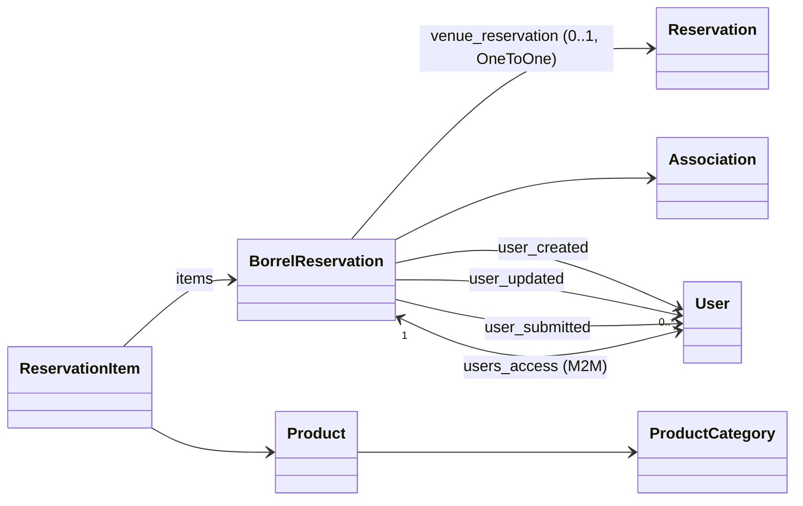

# `borrel/` &mdash; borrel reservations + inventory

A "borrel" is a Dutch student-association event with drinks. Borrels happen at the canteens; the boards of the participating associations need to book a venue, pre-declare which products they'll consume, and after the event reconcile what was actually used. This app owns that flow.

It's distinct from `orders/` &mdash; orders are individual transactions during a baker's shift; a borrel is a planned event with its own product list and its own settlement.

## Data model

- **`BorrelReservation`** &mdash; the booking itself. Owns its own `start`/`end`/`title`/`comments`/`association`, the tri-state `accepted` (None / True / False) approval flag, the three role users (`user_created`, `user_updated`, `user_submitted`) plus the `users_access` M2M, and a `join_code`. The optional OneToOne `venue_reservation -> venues.Reservation` ties the borrel to the underlying venue booking when one exists.
- **Queryable properties:** `active` (`RangeCheckProperty` on `start`/`end`) and `submitted` (`AnnotationProperty` derived from `submitted_at`). Both usable in `.filter()` / `.annotate()`. Regular properties `can_be_changed` and `can_be_submitted` gate UI actions.
- **`Product`** &mdash; an item that can be consumed at a borrel, grouped by `ProductCategory`.
- **`ProductCategory`** &mdash; product grouping (beer, soda, snacks, …); also relevant for the Silvasoft sync.
- **`ReservationItem`** &mdash; line item with `amount_reserved` (planned) and `amount_used` (settled). **Snapshots** `product_name`, `product_description`, `product_price_per_unit` at the time the item was added; the FK to `Product` is `SET_NULL`-on-delete so settlements remain stable when products are removed or repriced. `unique_together = (reservation, product_name)`.

## Lifecycle

1. **Plan.** An organiser creates a `BorrelReservation` for a venue and time. Optionally pre-fills the product list with expected quantities. Auto-emails the venue manager.
2. **Accept.** The venue manager flips `accepted=True`. Borrel appears in the calendar.
3. **Happen.** The actual borrel runs at the canteen.
4. **Settle.** After the event, the organiser fills in the actual quantities consumed. Once finalised the reservation is locked.
5. **Sync to accounting.** [`silvasoft/`](../silvasoft/) picks up the settled reservation and creates a `SilvasoftBorrelReservationInvoice` for the organising association. See that app's README.

## Permissions

The model has association-aware permission checks: only members of the organising association (or staff) can edit a reservation. The actual brevet-style "can you order this product" gate is in [`qualifications/`](../qualifications/) (e.g. only borrel-brevet holders can pour beer). Borrel-app code consults that app's `qualifications` mixin.

## Gotchas

- **Don't double-book a venue.** Like regular venue reservations, model-level `full_clean` catches collisions but only if you call it. Use `services.py` rather than direct `.save()` if there's logic to share.
- **Once settled, don't edit.** The Silvasoft sync may have already picked up the values. Edits after settlement require coordinating with whoever runs the accounting reconciliation.
- **Product price changes don't retroactively update line items.** `ReservationItem` snapshots the price at the time it was added so settlements are stable.
</content>
</invoke>