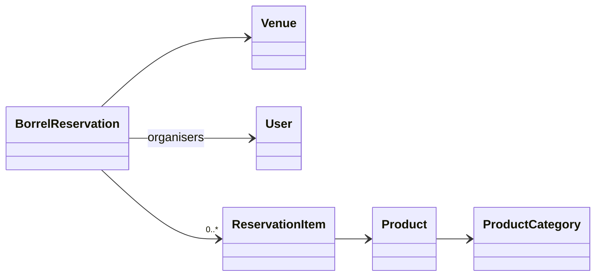

# `borrel/` &mdash; borrel reservations + inventory

A "borrel" is a Dutch student-association event with drinks. Borrels happen at the canteens; the boards of the participating associations need to book a venue, pre-declare which products they'll consume, and after the event reconcile what was actually used. This app owns that flow.

It's distinct from `orders/` &mdash; orders are individual transactions during a baker's shift; a borrel is a planned event with its own product list and its own settlement.

## Data model

- **`BorrelReservation`** &mdash; the booking itself: title, venue, start/end time, organising association, organisers, comments, an accepted flag like a regular venue reservation, plus borrel-specific fields (expected number of attendees, etc.).
- **`Product`** &mdash; an item that can be consumed at a borrel. Has price, VAT rate, category, an `is_active` flag.
- **`ProductCategory`** &mdash; grouping for the product list (beer, soda, snacks, …) and for the Silvasoft sync.
- **`ReservationItem`** &mdash; line item linking a `BorrelReservation` to a `Product` with both a planned quantity (declared in advance) and an actual quantity (filled in after the event).

## Lifecycle

1. **Plan.** An organiser creates a `BorrelReservation` for a venue and time. Optionally pre-fills the product list with expected quantities. Auto-emails the venue manager.
2. **Accept.** The venue manager flips `accepted=True`. Borrel appears in the calendar.
3. **Happen.** The actual borrel runs at the canteen.
4. **Settle.** After the event, the organiser fills in the actual quantities consumed. Once finalised the reservation is locked.
5. **Sync to accounting.** [`silvasoft/`](../silvasoft/) picks up the settled reservation and creates a `SilvasoftBorrelReservationInvoice` for the organising association. See that app's README.

## Permissions

The model has association-aware permission checks: only members of the organising association (or staff) can edit a reservation. The actual brevet-style "can you order this product" gate is in [`qualifications/`](../qualifications/) (e.g. only borrel-brevet holders can pour beer). Borrel-app code consults that app's `qualifications` mixin.

## Gotchas

- **Don't double-book a venue.** Like regular venue reservations, model-level `full_clean` catches collisions but only if you call it. Use `services.py` rather than direct `.save()` if there's logic to share.
- **Once settled, don't edit.** The Silvasoft sync may have already picked up the values. Edits after settlement require coordinating with whoever runs the accounting reconciliation.
- **Product price changes don't retroactively update line items.** `ReservationItem` snapshots the price at the time it was added so settlements are stable.
</content>
</invoke>