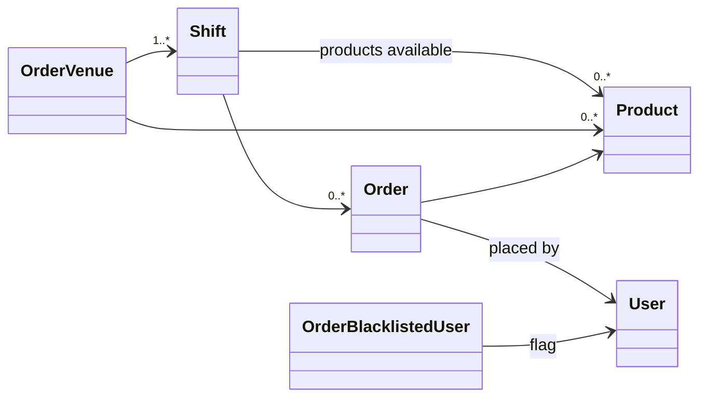

# `orders/` &mdash; ordering, shifts, products

This is the heart of TOSTI. Bakers run shifts; users place orders during those shifts; the system tracks who paid, what's ready, and who got blacklisted for not picking things up.

It's the biggest app in the project. Treat changes here as production-affecting &mdash; the canteens use this live, daily.

## Data model

- **`OrderVenue`** wraps a `venues.Venue` with ordering-specific config (e.g. whether ordering is enabled there).
- **`Product`** lives in an OrderVenue's catalogue: name, price, availability, max-per-shift, max-per-user, whether it needs preparation or just a barcode scan.
- **`Shift`** is a time window during which a baker accepts orders. It has start/end times, a max-orders cap, an "accepting orders" toggle (the hand button in the baker view), and a `finalized` flag once it's closed permanently.
- **`Order`** ties a user to a product within a shift. Status fields are `paid` and `ready`; both must be true before the customer picks it up. Has a `priority` field so baker-placed orders jump to the top of the queue.
- **`OrderBlacklistedUser`** flags users who didn't pay or pick up. Blacklisted users can't place new orders.

## Where the logic lives

- **`services.py`** &mdash; `add_user_order`, `list_active_shifts`. Permission checks, capacity checks, blacklist checks all happen here. View and MCP tool both call into the same service.
- **`models.py`** &mdash; the data and its invariants. `Shift.is_active`, `Shift.can_order`, `Product.is_available` are queryable properties (django-queryable-properties) so they work in `.filter()` and `.annotate()` without an N+1.
- **`mcp.py`** &mdash; `list_active_shifts` (read), `place_order` (scope-gated by `orders:order`).
- **`api/v1/`** &mdash; the REST endpoints powering the baker view's live queue, the user order page, the scanner.

## Polling

The baker view, the user order list, and the scanner all poll every few seconds. **Anything you add to the order-list endpoints needs to be cheap at scale.** Use `select_related` / `prefetch_related`, lean on queryable properties, and count queries with `django.db.connection.queries` if in doubt. There's a section on this in [`CONTRIBUTING.md`](../../CONTRIBUTING.md#performance-and-database-queries).

## The scanner

`/orders/<shift>/admin/scanner/` is the barcode-scanner flow for selling pre-packaged products at the counter (cans, snacks). Camera capture lives in `static/orders/js/admin-scanner.js`; the API endpoint is `PlayerTrackAddAPIView`-style POST that resolves the barcode → product → order. Scanned orders are marked with a "scanned" user-icon (`<i class="fa-solid fa-desktop">`) instead of a real user.

## Deposit transactions

Deposit cans are processed at the counter through the `transactions/` app, not this one. See the *Process deposit* explainer tab for the baker flow.

## Explainers

This app contributes the *Order*, *Manage a shift*, *Hand in deposit*, and *Process deposit* tabs to `/explainers/`. See `apps.py:OrdersConfig.explainer_tabs` for the registration and `templates/orders/explainer*.html` for the content.

## Gotchas

- **Two shifts in one venue at the same time is forbidden.** The constraint is in the model `clean`; rely on it rather than re-checking in views.
- **Finalizing a shift is permanent.** Once `finalized=True`, the shift is locked. There's no admin path to un-finalize without writing SQL by hand.
- **Don't roll your own "is the shift active" check.** Use `Shift.is_active` &mdash; it accounts for start, end, finalised, and the operator-flipped accepting-orders flag.
</content>
</invoke>