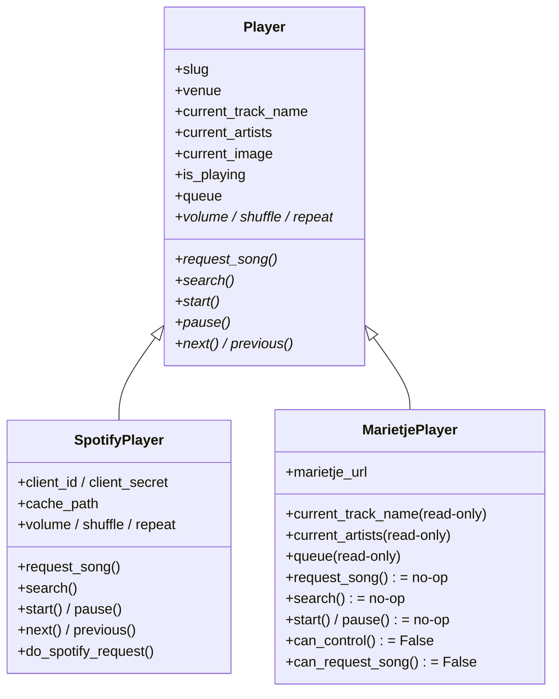
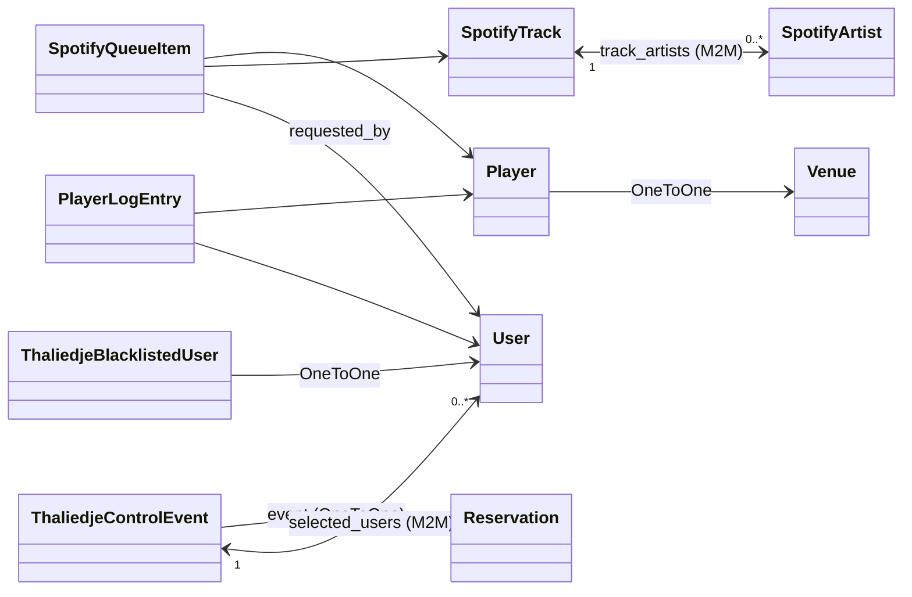

# `thaliedje/` &mdash; canteen music players

Thaliedje runs the shared jukebox in the Huygens canteens. Anyone with a Radboud account can request a song; the player plays it in the canteen for everyone there to hear.

There are two backends: **Spotify** (Noordkantine) and **Marietje** (Zuidkantine, read-only). They share a base `Player` model and a polymorphism layer (`InheritanceManager`), so most code paths can treat them uniformly.

## Player inheritance &mdash; SpotifyPlayer vs MarietjePlayer



`SpotifyPlayer` is the full-featured backend &mdash; queueing, searching, transport control, volume/shuffle/repeat, all backed by the Spotify Web API. `MarietjePlayer` is read-only: it can report what's currently playing in the Zuidkantine by polling Marietje's HTTP API, but all the control-plane methods are explicit no-ops and `can_control` / `can_request_song` return `False` so the UI hides the buttons. New player features should expect to be Spotify-only unless there's a concrete reason to extend Marietje.

## Data model



- **`Player`** is the polymorphic base (`slug`, OneToOne to `venues.Venue`). `SpotifyPlayer` and `MarietjePlayer` are the concrete subclasses; both store backend-specific credentials (`client_id`/`client_secret` and a per-player `cache_path`).
- **`SpotifyQueueItem`** is the TOSTI-side request log: which user requested which track at which time on which player. Note this is created for Spotify-backed players only (Marietje can't accept requests).
- **`SpotifyTrack` / `SpotifyArtist`** are denormalised caches so the request log keeps making sense after a track is removed from Spotify. `SpotifyTrack.track_artists` is the M2M between them.
- **`ThaliedjeBlacklistedUser`** &mdash; same idea as `OrderBlacklistedUser` but for song-request abuse.
- **`ThaliedjeControlEvent`** has a OneToOne to `venues.Reservation` and lets that reservation override the default request/control permissions for the duration of the booking. Permissions are split three ways: `association_*` (anyone in the organising association), `selected_users_*` (the M2M-linked users), and `everyone_*`. Also has `respect_blacklist` and `check_throttling` toggles. Queryable properties `start` / `end` / `active` lift the parent reservation's range so you can filter `ThaliedjeControlEvent.objects.filter(active=True)`; `player` resolves to `event.venue.player` for convenience.
- **`PlayerLogEntry`** is the audit log for control-plane actions (start, pause, next, etc.).

## Always use `select_subclasses()`

`Player.objects.get(...)` returns a base-class instance with all the `current_*` properties raising `NotImplementedError`. Always go through the `InheritanceManager`:

```python
player = Player.objects.select_subclasses().get(venue__slug=slug)
```

There's a helper in `mcp.py:get_player_for_venue` that does this. Use it.

## The auto-start trap

`SpotifyPlayer.request_song` queues the track. If the player is paused, it used to also try to start playback + skip to the new track. That can silently consume the just-queued song when Spotify rejects the `start_playback` call (which happens any time there's no active context &mdash; typical off-hours state). The current implementation only auto-starts when `_current_playback is not None`. See the regression tests in `tests/test_player.py`.

If you need to touch `request_song` again, re-read those tests first.

## Spotify API quirks worth knowing

- **`do_spotify_request` swallows `SpotifyException` and `ReadTimeout`.** Failed calls return `None`. Useful for resilience but easy to miss when debugging &mdash; if a behaviour you expected didn't happen, check Sentry logs for a "Spotify error" line.
- **`spotify.queue()` lags.** A track that just started playing can still appear at queue position 0 for a few seconds. The merged-queue work (see `services.py:observe_player_state` if present) tolerates this; new code should too.
- **`spotify.search()` returns a dict keyed by query type**, not a flat list of tracks. The MCP `search_tracks` service normalises both into the same flat shape; if you call `player.search()` directly, expect `{"tracks": [...], "albums": [...]}`.

## MCP

This app exposes `get_player_state`, `search_tracks`, and `request_song` to AI assistants. `search_tracks` is `openWorldHint: True` (it queries Spotify's external catalogue); `request_song` requires the `thaliedje:request` scope. See `mcp.py`.

## Tests

- `tests/test_mcp.py` covers the MCP tools and the `search_tracks` shape normalisation (regression for the Sentry crash from iterating Spotify's dict as a list).
- `tests/test_player.py` covers the `request_song` auto-start logic and Spotify projection.
</content>
</invoke>