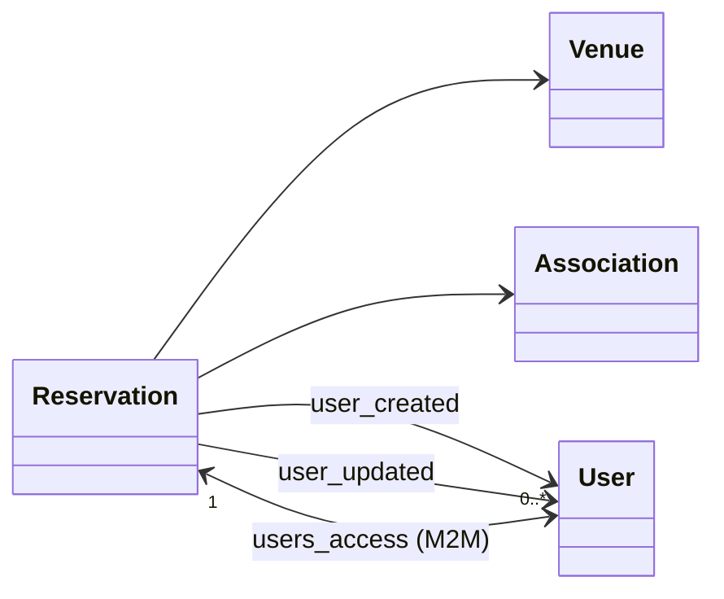

# `venues/` &mdash; venues + reservations + calendar

A "venue" in TOSTI is a physical room or area (canteen, meeting room, brew room, etc.) that can host shifts, host music players, be reserved, or all three. This app owns the venue catalogue and the reservation system; other apps (`orders`, `thaliedje`, `borrel`) hang their own concerns off the `Venue` model.

## Data model

- **`Venue`** &mdash; `name`, `slug`, `active`, `color_in_calendar`, `can_be_reserved`, `automatically_accept_first_reservation`. No FKs out &mdash; other apps point at it (`orders.OrderVenue.venue` OneToOne, `thaliedje.Player.venue` OneToOne, etc.).
- **`Reservation`** &mdash; `title`, `start`, `end`, `comments`, `needs_music_keys`, and the tri-state `accepted` (`None` = pending, `True` = approved, `False` = rejected). Bookkeeping fields: `user_created`, `user_updated`, the `users_access` M2M, and a one-shot `join_code` (auto-generated on first save) so the organisers can share the reservation with people who weren't on the original list.
- **`Reservation.active`** is a queryable property (`RangeCheckProperty` on `start`/`end`); usable in `.filter()` / `.annotate()`. `can_be_changed` is a regular `@property` that's true when the reservation is still pending and hasn't started yet.

Other apps refer to `Venue` as a foreign key (`orders.OrderVenue.venue`, `thaliedje.Player.venue`, etc.) but they don't extend the venue itself. If you need venue-related config for your app, follow that pattern.

## The calendar

`/venues/calendar/` shows a FullCalendar view of all reservations across all reservable venues. Each reservation is colour-coded by its venue. iCal feeds are exposed via `django-ical` so anyone can subscribe to a venue's reservations in their own calendar app.

## Approval workflow

New reservations are created with `accepted=None` (pending). The user gets an email confirming the request was received; a notification email goes to the venue manager. The manager reviews and either accepts (`accepted=True`) or rejects (`accepted=False`). Reservations are never auto-deleted on rejection &mdash; rejected ones still show up in the admin so the audit trail is intact.

There's an `automatically_accept_first_reservation` venue-level flag that lets specific venues short-circuit this for the first booking (subject to no overlap). Use carefully.

## Services

`services.py:create_reservation` is the canonical reservation-creation path:

- Checks the venue accepts reservations (`venue.can_be_reserved`).
- Checks `end > start`.
- Runs model `full_clean()` (catches collisions and other model-level invariants).
- Calls `send_reservation_request_email`.

The MCP `create_venue_reservation` tool and any future REST creation endpoint should both go through this service rather than re-implementing the validation. The `venues:write` scope gates the MCP path.

## Gotchas

- **`Venue.objects.all()` includes inactive venues.** Use the queryset manager methods to filter active-only if that's what you want.
- **Reservations don't lock out other reservations on save** &mdash; collision detection happens in `full_clean`. If you create a reservation without `full_clean`, you can double-book a venue.
- **The `slug` is the public identifier**, not the pk. URL converters and the MCP tool both resolve by slug.
</content>
</invoke>